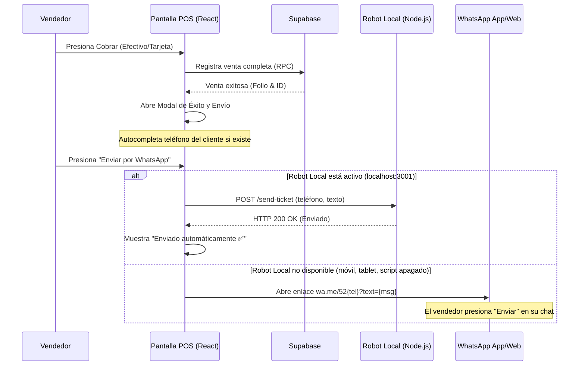

# Plan de Diseño: Comprobante de Venta por WhatsApp e Impresión

Este documento especifica la arquitectura, el diseño de interfaz y la lógica de negocio para permitir a los vendedores de **AGROMAR** ofrecer comprobantes de venta (tickets) impresos o enviados por WhatsApp al finalizar una compra desde la pantalla del POS.

---

## 1. Objetivos y Alcance
* **Impresión Local:** Permitir al vendedor abrir la ventana de impresión nativa del navegador optimizada para tiqueteras térmicas (80mm o carta).
* **Envío por WhatsApp:**
  * **Modo Manual (Portátil/Móvil):** Abrir un enlace de WhatsApp Web o la App oficial prellenado con el ticket formateado.
  * **Modo Automático (Local de fondo):** Detectar si hay un script de automatización corriendo en el puerto local `3001` y enviar el mensaje directamente mediante una petición HTTP por detrás, sin abrir pestañas nuevas.
* **Autocompletado de Teléfono:** Si el cliente seleccionado tiene un teléfono guardado, precargarlo en la interfaz para ahorrar tiempo al vendedor.

---

## 2. Flujo de Experiencia del Usuario (UX)



---

## 3. Formato del Comprobante en Texto (WhatsApp)
El ticket se formateará como una cadena de texto codificada en URL que se verá en el chat de la siguiente forma:

```text
🌾 *AGROMAR - COMPROBANTE DE COMPRA* 🌾
----------------------------------
*Folio:* V-2026-87429
*Fecha:* 14/06/2026 19:15
*Cliente:* Juan Pérez (Rancho: El Capulín)
*Atendió:* Mauricio Aguilar
----------------------------------
*Detalle de Compra:*
• 2.00 x Semilla de Maíz (costal) — $2,400.00
• 1.50 x Insecticida Versa (litro) — $450.00
----------------------------------
*Total:* $2,850.00 MXN
----------------------------------
¡Gracias por su preferencia!
```

---

## 4. Cambios Técnicos en el Código

### A. Modificaciones en `src/features/pos/POS.tsx`
* **Estado de Checkout (`checkoutStatus`):** Extenderlo para que al ser exitoso no muestre solo un aviso simple, sino que active un modal detallado de finalización (`CheckoutSuccessModal`).
* **Modal de Éxito (`CheckoutSuccessModal`):**
  * Mostrará felicitaciones, el folio generado y el total cobrado.
  * Botón para abrir la vista de impresión del navegador.
  * Entrada de texto para escribir/editar el teléfono del cliente (10 dígitos).
  * Botón de "Enviar por WhatsApp".
* **Lógica del Envío (`handleSendWhatsApp`):**
  1. Limpiar el número de teléfono (quitar espacios, guiones).
  2. Construir el mensaje de texto estructurado con los datos del carrito (`cartItems`).
  3. Ejecutar un `fetch` hacia `http://localhost:3001/send-ticket` con un timeout de 800ms.
  4. Si falla o es cancelado por el navegador, hacer un `window.open` con `https://wa.me/52${phone}?text=${encodeURIComponent(text)}`.

---

## 5. Criterios de Aceptación
1. **Autocompletado:** Si el cliente Servín tiene el número `4621078185` guardado, al cobrar se debe prellenar el campo con ese valor.
2. **Fallback correcto:** Al simular una venta desde un móvil, hacer clic en "Enviar" debe redirigir a la app oficial de WhatsApp con el número y texto precargado.
3. **Impresión:** El botón de imprimir debe llamar a `window.print()` o aislar la visualización del ticket para imprimir solo el comprobante.
